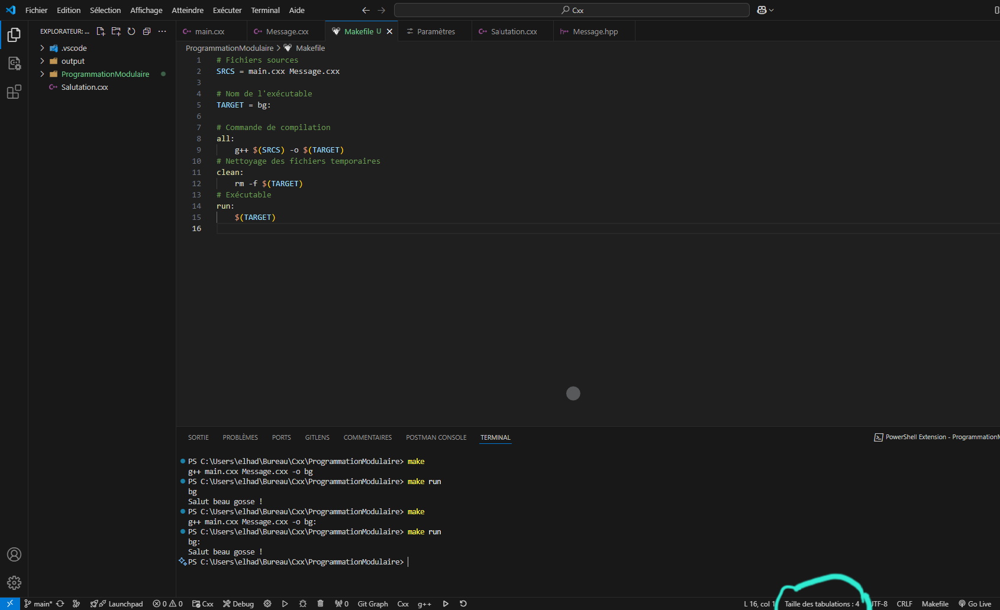
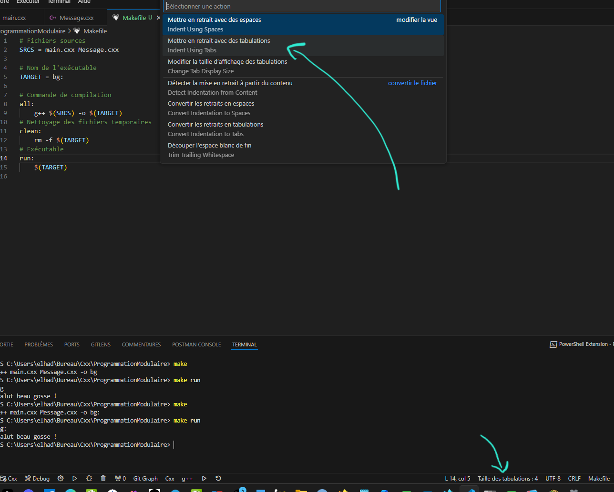
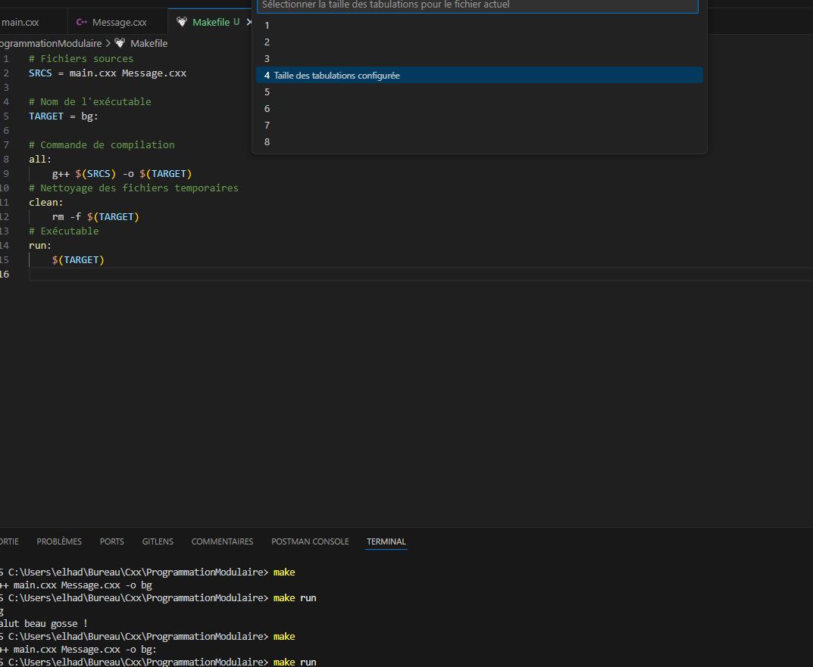
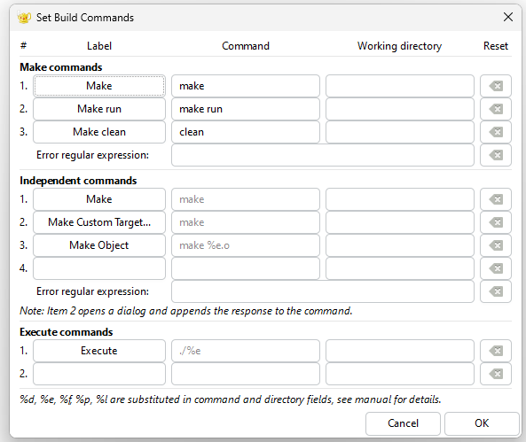

# Configuration du Makefile sur Visual Studio Code

Ce guide explique comment configurer et utiliser un Makefile dans Visual Studio Code pour compiler et exécuter un projet C++.


## Avant toute chose configurer Vscode

Aller dans la barre d'état, Taille des Tabulatons, puis option "Mettre en retrait avec des tabulations"
Selectionner le nombre qui vous convient et enregistrer.





Vous pouvez aussi supprimer et resaisir de A à Z votre Makefile pour éviter les espaces blancs sinon elle marchera pas.

## Étape de Création du Makefile

Créez un fichier nommé `Makefile` dans le répertoire racine de votre projet et ajoutez-y le contenu suivant :

```makefile
# Fichiers sources
SRCS = main.cxx Message.cxx

# Nom de l'exécutable
TARGET = bg

# Commande de compilation
all:
    g++ $(SRCS) -o $(TARGET)

# Nettoyage des fichiers temporaires
clean:
    rm -f $(TARGET)

# Exécution du programme
run:
    ./$(TARGET)

```
## Exécuter votre Makefile via les commandes:
```
make
```
```
make run
```
```
clean ou make clean (selon la config)
```

# Pour la configuration de Geany sur Linux (exemple de Kali-Linux)
Aller dans :
```
sudo nano ~/.config/geany/geany.conf
```
Modifie Vite :
[VTE]
```
cursor_shape=block  # Options : block, underline, bar
```
DOnc le remplacer par:
```
cursor_shape=bar
```
Enregistrer et Allez dans le settings de votre terminal bash ou zsh:
```
sudo nano ~/.zshrc (ou bash)
```
Ajouter à la fin de votre config:
```
echo -e "\e[6 q" 
```
Puis faite :
```
source ~/.zshrc
```

Redémarrer Geany pour avoir votre terminal en |.
Pour plus de personnalisation comme copie-colle:
[tools]
terminal=/usr/bin/gnome-terminal

Puis installer les dépendances:
```
sudo apt install xclip xsel
sudo apt update && sudo apt upgrade
```

## Pour configurer la compilation de Makefile sur Geany, Il faut suivre ces étapes: 
Se placer depuis ton fichier Makefile:
Aller dans l'onglet "Build"
Sélectionner "Set Build Commands" vous verrez dans ce cas "Make Commands" (Sans être dans le fichier Makefile cette option n'apparaîtra pas.)
```
1ér Label =  Make       Command = make
2ém Label = Make run    Command = make run
3ém Label = Make clean  Command = clean (Cela dependra de votre configuration de fichier Makefile  et c'est même optionnel)
```


Plus de détail en image dans mon cas:



