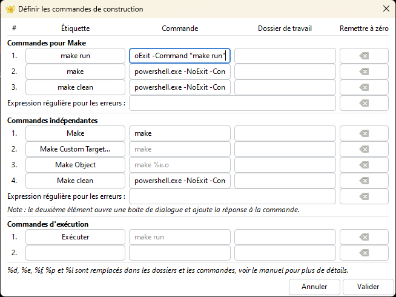

# Configuration du Makefile sur Visual Studio Code

Ce guide explique comment installer configurer et utiliser un Makefile dans Visual Studio Code pour compiler et exécuter un projet C++.

## Installation (Sur Windows) :
Installer MinGw via le site officiel.
Crée un lien symbolique pour éviter de modifier l'original ```mingw32-make.exe```.
Tu peux ```créer un lien symbolique nommé make.exe qui pointe vers mingw32-make.exe```.

Sur windows( car Linux n'a pas ces problèmes), exécuter la commande :
```
New-Item -ItemType SymbolicLink -Path C:\MinGW\bin\make.exe -Target C:\MinGW\bin\mingw32-make.exe
```

Maintenat vérifier votre version make :
```
make --version
```


## (Avec Vscode) Avant de continuer configurer Vscode :
Télécharger l'extension ``` Makefile ``` depuis le gestionnaire des extensions.
Aller dans la barre d'état, Taille des Tabulatons, puis option "Mettre en retrait avec des tabulations"
Selectionner le nombre qui vous convient et enregistrer.


Vous pouvez aussi supprimer et resaisir de A à Z votre Makefile pour éviter les espaces blancs sinon elle marchera pas.

## Étape de Création du Makefile

Créez un fichier nommé `Makefile` dans le répertoire racine de votre projet et ajoutez-y le contenu suivant :

```makefile
# Fichiers sources
SRCS = main.cxx Message.cxx

# Nom de l'exécutable
TARGET = bg

# Commande de compilation
all:
    g++ $(SRCS) -o $(TARGET)

# Nettoyage des fichiers temporaires
clean:
    rm -f $(TARGET)

# Exécution du programme
run:
    ./$(TARGET)
```

Remplacer :   ``` rm -f $(TARGET)   par   del $(TARGET)```  si vous êtes sur Windows
## Exécuter votre Makefile via les commandes:
```
make
```
```
make run
```
```
clean ou make clean (selon la config)
```
# Configuration du Makefile sur Geany

Le reste explique comment installer configurer et utiliser un Makefile dans Geany pour compiler et exécuter un projet C++.
# (Optionnel) Pour la configuration de Geany sur Linux :
Aller dans :
```
sudo nano ~/.config/geany/geany.conf
```
Modifie Vite :
[VTE]
```
cursor_shape=block  # Options : block, underline, bar
```
DOnc le remplacer par:
```
cursor_shape=bar
```
Enregistrer et Allez dans le settings de votre terminal bash ou zsh:
```
sudo nano ~/.zshrc (ou bash)
```
Ajouter à la fin de votre config:
```
echo -e "\e[6 q" 
```
Puis faite :
```
source ~/.zshrc
```

Redémarrer Geany pour avoir votre terminal en |.
Pour plus de personnalisation comme copie-colle:
[tools]
terminal=/usr/bin/gnome-terminal

Puis installer les dépendances:
```
sudo apt install xclip xsel
sudo apt update && sudo apt upgrade
```

## Configurer et Compiler le Makefile sur Geany (Fais sur Linux mais pareil pour les autres distributions), il faut suivre ces étapes: 
Se placer depuis ton fichier Makefile:
Aller dans l'onglet "Build"
Sélectionner "Set Build Commands" vous verrez dans ce cas "Make Commands" (Sans être dans le fichier Makefile cette option n'apparaîtra pas.)
```
1ér Label =  Make       Command = make
2ém Label = Make run    Command = make run
3ém Label = Make clean  Command = clean (Cela dependra de votre configuration de fichier Makefile  et c'est même optionnel)
```
Dans la case "Commandes d'exécution" sur l'image remplacer (cas de Linux) ./%e par make run && xterm -e "./%e"


Sur windows, simmilaire (selon votre perminal pwsh ou cmd)
Il ne faut pas oublier la partie 1 Installation de MinGW (Sur Windows) : car la commade make ne marchera pas, donc activer le lien Symbolique ```mingw-make.exe ---> make.exe```.


# La compilation avec le Terminal de plusieurs ficiers (Sans Makefile):
On fait Compilation des fichiers objets associé à chaque fichier source :
```
PS C:ProgrammationModulaire> g++ -c .\App.cxx -o App.o
PS C:ProgrammationModulaire> g++ -c .\Message.cxx -o .Message.o
```

Puis faire une édition des liens ( sans "-c" )
```
PS C:ProgrammationModulaire> g++ .\Message.o .\App.o -o monprogramme
```
On exécute le programme  avec la commande :
```
PS C:ProgrammationModulaire> .\monprogramme.exe
```
Salut beau gosse ! # En affichage


# Explication de la fonction Point:
Un peu d'explication de la fonction sur cette image

